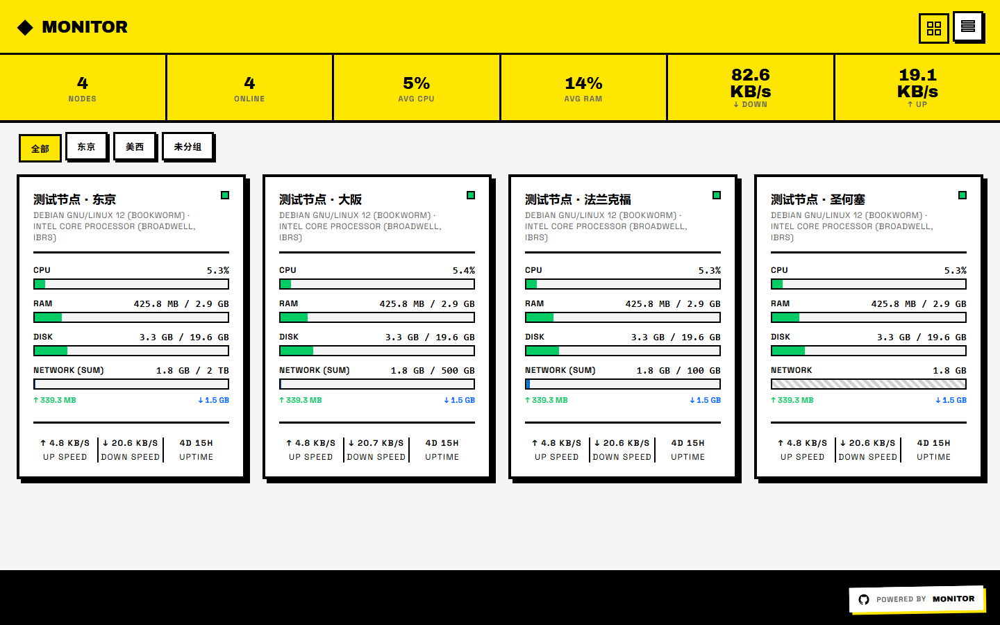

# Monitor 1999

把 [ricebucket/komari-theme-1999](https://github.com/r1cebucket/komari-theme-1999)（基于原版 **v1.0.1**）移植到
[极简探针 Monitor](https://github.com/monitor-probe/monitor) 的主题。

## 主要功能

- **新粗野主义视觉**：粗边框、硬阴影、像素化的加载动画，强调色可选（黄 / 红 / 蓝 / 绿 / 紫）。
- **卡片 / 列表双视图**：访客的视图偏好记在本机，站点可在后台设置默认视图。
- **节点卡片**：CPU、内存、磁盘、流量四条进度条，上行 / 下行速率与运行时间；流量条按 Hub 的计费周期口径与 `sum` / `max` / `up` / `down` 模式绘制，未设流量上限时画成斜纹。
- **节点详情**：硬件 / 系统 / 存储 / 网络 四块信息（CPU 型号与核心数、架构、虚拟化、系统、内核、运行时间、最近上报、内存 / 交换 / 磁盘用量、双向速率与累计流量、TCP/UDP 连接数）。
- **历史曲线**：CPU、内存、磁盘、网络四张图，窗口 1H / 6H / 24H / 3D / 7D（登录后的管理员多一个 30D）。
- **延迟区块**：按探测线路列出最新延迟、丢包率、MIN / AVG / MAX / P50 / P99，并画出延迟曲线。
- **小动效**：数字变化时的乱码翻牌、像素骨架；详情页支持 `Esc` 关闭与键盘操作。
- **离线可用**：字体与 ECharts 都打进主题包，不依赖第三方 CDN。

## 安装

首次安装需从 Releases 下载 theme.tar.gz 上传至探针后台，后续可在主题卡片上点击从 GitHub 更新。

## 许可

MIT。原主题 [Komari Theme 1999](https://github.com/r1cebucket/komari-theme-1999) 由 [ricebucket](https://github.com/r1cebucket) 编写，本仓库是它到极简探针的移植版本。
